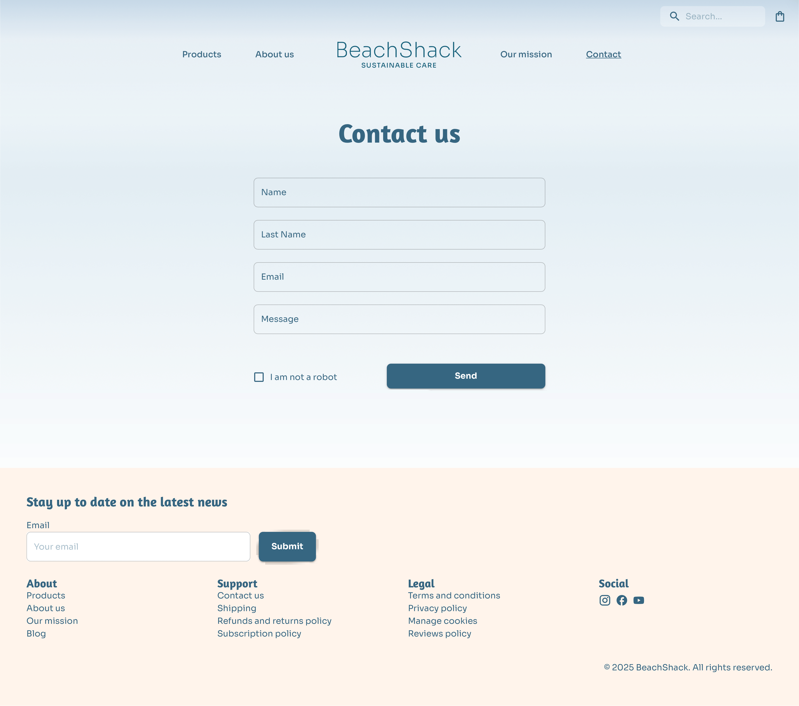

# BeachShack — E-Commerce website

A full-stack e-commerce web application built for portfolio purposes, showcasing a curated range of sustainable personal care and hygiene products. Inspired by ocean aesthetics, the platform emphasizes a clean, fresh, and eco-conscious user experience.

# Screenshots

# Tech Stack
### 🧑‍💻 Frontend

- React – Component-based UI development
- Vite – Fast development and build tooling
- React Router – Client-side routing

### 🎨 UI & Styling
- Material UI – component library, theming and styling system

### 🌐 API & Data Handling
- Axios – API requests

### 💳 Payments
- Stripe – Payment integration

### ⚙️ Backend
- Node.js/express
- Database – Mongo DB

# Features
- Products stored and managed in MongoDB Atlas
- Filter products by category (Body, Hair Care, Skin Care), type and price range, with sorting by name and price (ascending & descending)
- Functional search bar
- Contact form with front-end validation
- Shopping bag with global state managed via React Context API
- Secure checkout powered by Stripe in test mode 
- Responsive design for mobile and desktop

# Instaling

## Clone the repository
git clone https://github.com/your-username/beachshack.git

The only thing you need to update is replacing your-username with your actual GitHub usernam

## Install and run the backend
cd server

npm install

npm start

## In a new terminal, install and run the frontend
cd client

npm install

npm run dev

# Version History

v1.0 – Product listing, shopping bag, and Stripe checkout

v2.0 – Search bar, filters by category, type and price, sorting

v3.0 – Material UI redesign